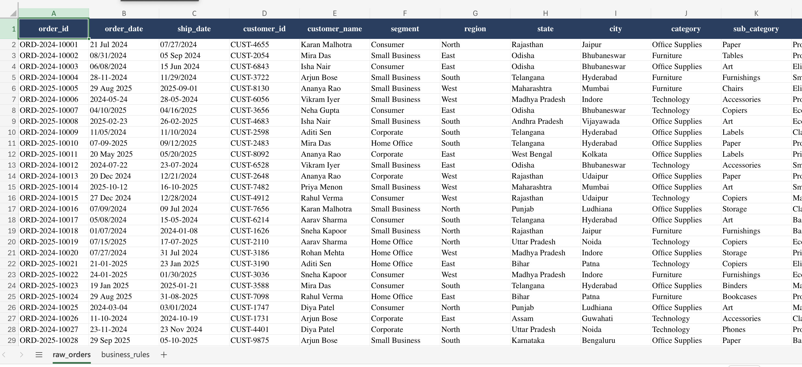
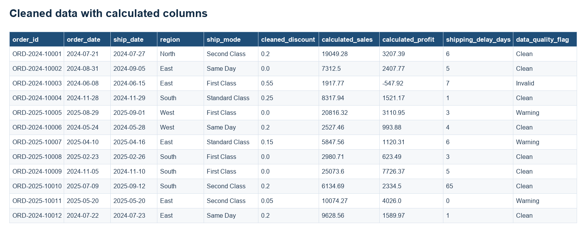
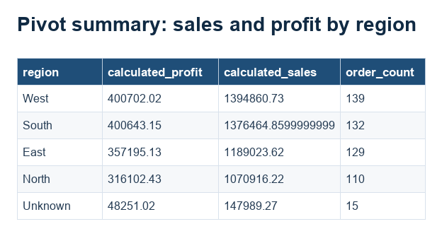
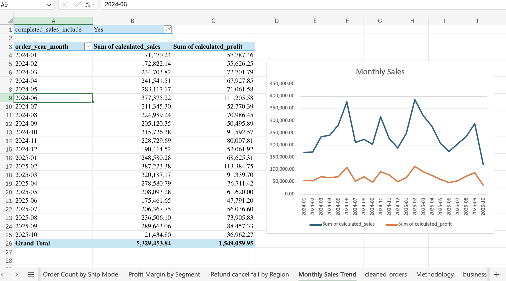

# Part 1: Business Data Cleaning, Validation & Excel Reporting

## 1. Problem summary

This repository cleans and validates order-level retail sales data exported from multiple systems. It preserves the original workbook, produces a separate analysis-ready dataset, documents every business-rule decision, and provides Excel reports for data-quality and business review.

## Required structure

```text
part1_data_cleaning/
├── data/
│   ├── raw_orders.xlsx
│   └── cleaned_orders.xlsx
├── outputs/
│   ├── data_quality_report.xlsx
│   ├── pivot_summary.xlsx
│   └── cleaning_log.md
├── screenshots/
│   ├── raw_data_preview.png
│   ├── cleaned_data_preview.png
│   ├── pivot_summary_1.png
│   └── pivot_summary_2.png
└── README.md
```

## 2. Dataset description

- Raw records: **932**
- Exact duplicate copies removed: **20**
- Final retained records: **912**
- Main fields include order and shipping dates, customer and product dimensions, quantity, unit price, discount, sales, cost, profit, payment status, and order status.

The raw workbook is preserved unchanged in `data/raw_orders.xlsx`. All cleaned values, calculated fields, rule flags, and duplicate decisions appear in `data/cleaned_orders.xlsx`.

Dataset Link : `https://drive.google.com/drive/folders/1o_tazBI-6cSJyRqKwOH0Hyq8Y29zGbHV`

## 3. Tools used

- Microsoft Excel-compatible `.xlsx` workbooks
- Excel formulas including `TRIM`, `CLEAN`, `SUBSTITUTE`, `PROPER`, `IF`, `IFERROR`, `COUNTIF`, `COUNTIFS`, `SUMIF`, `SUMIFS`, `ABS`, `TEXT`, `MONTH` and `YEAR`
- Formula-backed Excel tables with sorting and filter controls
- Markdown for documentation

## 4. Cleaning steps performed

1. Preserved the original raw workbook and created a separate cleaned workbook.
2. Standardized the ten required text fields by removing extra spaces and control characters and applying consistent case.
3. Filled missing region and ship mode values with `Unknown` and flagged them.
4. Converted slash, hyphen, ISO, and text-month dates using explicit source conventions.
5. Calculated shipping delay and flagged ship dates earlier than order dates.
6. Removed only later copies of fully identical rows.
7. Retained and flagged conflicting versions of repeated order IDs.
8. Converted percentage-text discounts to numeric values and conditionally imputed eligible blanks to zero.
9. Recalculated sales, profit, profit margin, order month, order year, mismatch indicators, completed-sales inclusion, and data-quality classification.
10. Produced formula-backed data-quality and business-summary workbooks.

## Core calculations

```text
calculated_sales = quantity × unit_price × (1 − cleaned_discount)
calculated_profit = calculated_sales − cost
profit_margin = calculated_profit ÷ calculated_sales
shipping_delay_days = clean_ship_date − clean_order_date
sales_mismatch = ABS(source sales − calculated_sales) > 0.05
profit_mismatch = ABS(source profit − calculated_profit) > 0.05
```

Completed-sales inclusion requires:

```text
Completed order
+ Paid payment
+ data_quality_flag is not Invalid
+ exact duplicate action is Keep
+ no conflicting duplicate review flag
```

This gives **537 eligible completed-sales records**.

## 5. Business rules applied

- Missing region and ship mode values become `Unknown` and are flagged Warning.
- Valid discounts range from 0% through 50%, inclusive.
- Negative and above-50% discounts are Invalid.
- Missing discounts become 0 only when the other required sales fields are valid.
- Cancelled and Returned orders do not enter completed-sales summaries.
- Failed, Refunded, and Pending payments do not enter completed-sales summaries.
- Refunded records are separately summarized by region.
- Ship dates earlier than order dates are Invalid.
- Exact duplicate copies are removed; conflicting repeated IDs are retained and flagged.
- Calculation mismatches use a tolerance of 0.05.

## 6. Data-quality issues

| Issue | Count | How obtained |
|---|---:|---|
| Exact duplicate copies removed | 20 | Later occurrences of an identical 21-field raw-row signature |
| Distinct duplicate order IDs | 31 | Distinct IDs appearing more than once in raw data |
| Conflicting duplicate IDs | 12 | Repeated IDs with more than one distinct full-row version |
| Conflicting records retained | 24 | All distinct versions belonging to conflicting IDs |
| Missing region | 25 | Final `clean_region = Unknown` |
| Missing ship mode | 21 | Final `clean_ship_mode = Unknown` |
| Missing discount imputed | 18 | Raw discount blank and cleaned discount 0 with valid sales fields |
| Negative discount | 15 | `cleaned_discount < 0` |
| Discount above 50% | 15 | `cleaned_discount > 0.5` |
| Ship date before order date | 21 | `clean_ship_date < clean_order_date` |
| Cancelled orders | 145 | Final order status count |
| Returned orders | 163 | Final order status count |
| Failed payments | 69 | Final payment status count |
| Refunded payments | 71 | Final payment status count |
| Pending payments | 86 | Final payment status count |
| Sales mismatches | 64 | Absolute difference greater than 0.05 |
| Profit mismatches | 64 | Absolute difference greater than 0.05 |

Issue categories overlap. The mutually exclusive final classification is:

| Final classification | Count |
|---|---:|
| Clean | 505 |
| Warning | 305 |
| Invalid | 102 |
| **Total** | **912** |

## Data-quality report

`outputs/data_quality_report.xlsx` includes:

- Summary
- Missing-value summary
- Duplicate summary and duplicate-ID detail
- Invalid-discount summary
- Date-issue summary
- Order/payment-status summary
- Sales/profit mismatch summary
- Final Clean vs Warning vs Invalid count
- Row-level issue details
- Methodology and calculation guide

Each required count includes an explanation and an Excel check formula so an evaluator can trace the result.

## 7. Pivot reports

`outputs/pivot_summary.xlsx` includes:

- Completed sales, profit, and order count by region
- Completed sales and profit by category and sub-category
- Completed order count by ship mode
- Aggregate completed profit margin by customer segment
- Refunded, cancelled, and failed records by region
- Monthly completed-sales and profit trend
- Business overview and methodology sheets

The region and category/sub-category outputs are filtered to eligible completed sales and sorted by sales descending. Ship mode is sorted by completed-order count, segment by aggregate margin, and the monthly report chronologically. The tables contain filter controls.

## 8. Key business insights

- Eligible completed orders: **537**
- Eligible completed sales: **5,329,453.84**
- Eligible completed profit: **1,549,059.94**
- **South** generated the highest eligible sales: **1,427,391.82**, with profit of **408,387.90**.
- **West** had the highest eligible completed-order count: **140**.
- **Home Office** produced the highest aggregate completed profit margin: approximately **30.2%**.
- **Standard Class** was the most-used eligible ship mode: **145 orders**.
- **Technology – Copiers** was the highest-sales category/sub-category combination: **636,659.34**.
- **February 2025** was the strongest eligible sales month: **387,223.38**.

## 9. Assumptions and limitations

- Slash dates are month-first because source values such as `08/31/2024` are unambiguous.
- Hyphen dates are day-first because source values such as `28-11-2024` are unambiguous.
- Missing region and ship mode values are not inferred without master data.
- The correct version of a conflicting duplicate cannot be established from the dataset alone.
- Issue counts overlap and must not be added to derive the total number of flagged records.
- The reports use transparent formula-backed Excel summary tables rather than native PivotTable cache objects.

## 10. Screenshots included

### Raw dataset before cleaning



### Cleaned dataset with calculated columns



### Any major pivot summary



### Another major pivot summary




